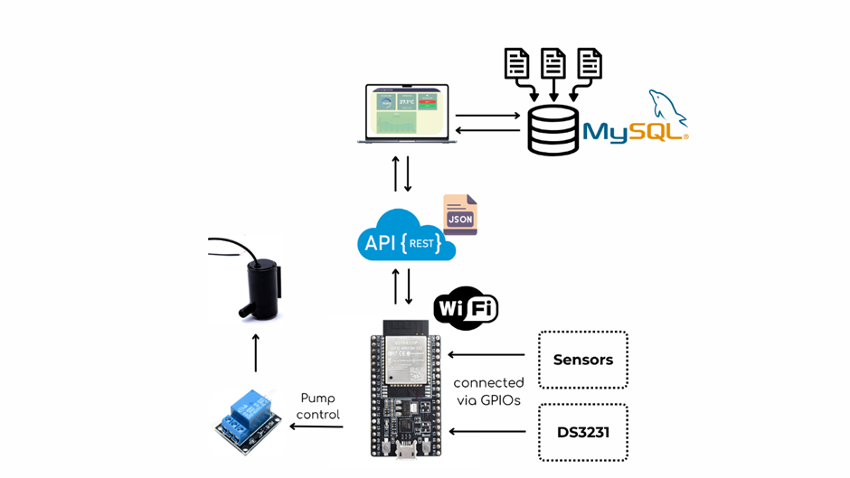

# Smart Watering System
A smart irrigation system developed as a project for the **Embedded System & Wireless Network (NT131)** course, class **NT131.P21**. Utilizing an ESP32 microcontroller to monitor soil moisture, temperature, and humidity, and control a water pump for automated plant watering. The system collects sensor data periodically, sends it to a server over a wireless network, and provides a web interface for real-time monitoring and control.

## Table of Contents
- [Features](#features)
- [Hardware Requirements](#hardware-requirements)
- [Software Requirements](#software-requirements)
- [Configuration](#configuration)
- [Project Structure](#project-structure)

## Features
- **Environmental Sensing**: Tracks temperature and humidity and soil moisture with different sensors. 
- **Automated Watering**: Controls a water pump based on moisture thresholds or manual input.
- **Deep Sleep Mode**: Enters deep sleep mode between 00:00 and 05:00 to conserve energy.
- **Real-Time Clock (RTC)**: Support data collection even without WiFi and schedule for deep sleep using DS3231 module.
- **Email Sending**: Send email in the event of sensor failure or water shortage.
- **WiFi Connectivity**: Connects to a local network to send sensor data to a server via REST API.
- **Web Interface**: A standalone website for monitoring and controlling ESP32's activity.
- **Graph Visualization**: Retrieve 10 latest entries based on Plant ID to draw a graph of soil moisture.
- **Interactive Website**: Updates dynamically by polling the database every few seconds for the latest data.

## Hardware Requirements
- ESP32 Development Board (e.g., ESP32-WROOM-32)
- Capacitive Soil Moisture Sensor
- DHT22 Temperature and Humidity Sensor
- DS3231 RTC Module
- Water Pump (with relay module for control)
- Water Level Sensor
- Jumper wires, breadboard, and power supply (5V/3.3V)

## Software Requirements
- **Arduino IDE** or **PlatformIO** for ESP32 programming
- **Node.js** and **MySQL** for the backend server
- Arduino Libraries:
  - `WiFi`
  - `DHT`
  - `RTClib`
  - `ESPAsyncWebServer`
  - `ESPAsyncTCP`
  - `ArduinoJson`
  - `ESP_Mail_Client`
  - `SPIFFS`
- Node.js Dependencies:
  - `express`
  - `mysql2` 
  - `cors`

## Configuration
- These files must be configured before running:
  - backend/.env: Rename `backend/.template.env` to `.env` and update it with your MySQL database credentials Follow instructions in the file.
  - ESP32/config.h: Rename `ESP32/config.template.h` to `config.h` and update it with your WiFi credentials, IP address for server host and email credentials. Follow instructions in the file.
## Project Structure
